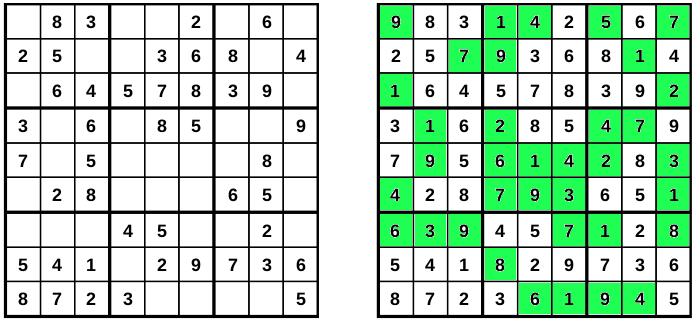
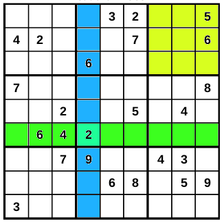
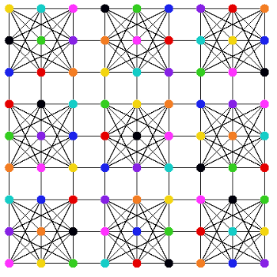

# KaraSu - Sudoku solver

Table of contents
1. Introduction
2. Welsh-Powell algorithm
3. Sudoku puzzle
4. Implementation
   * Problems with Welsh-Powell
   * Saturation degree
5. Referencies

## 1 - Introduction
Graph coloring theory is a branch of graph theory, which in turn is part of discrete mathematics. Graph coloring involves assigning 'colors' (or labels) to certain elements of a graph (usually vertices or edges) in such a way that certain rules are followed.

**Vertex Coloring**

In its most common form, vertex coloring, it involves assigning a color to each vertex of the graph so that two adjacent vertices (i.e., connected by an edge) have different colors. The goal is to find the minimum number of colors needed to color the graph in this way. This number is called the chromatic number of the graph.

**Edge Coloring**

Another variation is edge coloring, where colors are assigned to the edges of the graph. Here, the goal is to color the edges so that two incident edges (i.e., edges that share a vertex) do not have the same color. The minimum number of colors needed in this case is called the chromatic index of the graph.

**Problems and Complexity**

Many graph coloring problems are NP-complete, meaning that no efficient algorithm is currently known to solve them in general, especially for large graphs. However, there are specific classes of graphs (such as trees, cycles, or planar graphs) for which efficient algorithms exist. For instance, the Four Color Theorem states that any planar graph can be colored using at most four colors.

## 2 - Welsh-Powell algorithm

The **Welsh-Powell algorithm** is a greedy algorithm proposed by D. J. A. Welsh and M. B. Powell in 1967 [1]. Based on locally optimal decisions, it is used to find a vertex coloring of a graph, aiming to minimize the number of colors used. This algorithm is based on a simple and efficient strategy, which does not always guarantee the optimal chromatic number but tends to produce good solutions, especially for large graphs, but faster between other algorithms as shown by M. Aslan and N. A. Baykan in their work [2] in 2016.
The algorithm can be summarized in the following steps:
1. Find the degree of each node;
2. List the nodes in order of descending degrees;
3. Color the first node with color 1;
4. Move down the list and color all the nodes not connected to the coloured node, with the same color;
5. Repeat step 4 on all uncolored nodes with a new color, in descending order of degrees until all the nodes are coloured.

Below is a simple example with only three colors (green, yellow, blue):

step 1: Find the degree of each node.

  

    
  

  

  | Node | Degree |
  |------|--------|
  | 1    | 2      |
  | 2    | 3      |
  | 3    | 2      |
  | 4    | 1      |
  | 5    | 2      |

  

step 2: List the nodes in order of descending degrees.
nodes listed: 2, 1, 3, 5, 4

step 3: Colour the first vertex with green color.

  

    
  

  

  | Node | Degree |
  |------|--------|
  | 2    | color green|
  | 1    | don’t color: adjacent to 2|
  | 3    | don’t color: adjacent to 2|
  | 5    | don’t color: adjacent to 2|
  | 4    | color green|

  

List updated: 1, 5, 3

step 4: Colour the first node in the list with yellow color.

  

    
  

  

  | Node | Degree |
  |------|--------|
  | 1    | color yellow|
  | 3    | don’t color: adjacent to 1|
  | 5    | color yellow|

  

List updated: 3

step 5: Colour last node with blue color.

  

    
  

  

  | Node | Degree |
  |------|--------|
  | 3    | color blue|

  

The Welsh-Powell algorithm has a time complexity of $O(n^2)$, where $n$ is the number of vertices in the graph, mainly due to the sorting step and the check for available colors for each vertex. Although it does not always guarantee an optimal coloring, it tends to produce good results in many practical cases, especially for dense graphs.

The Welsh-Powell algorithm is useful in many real-world applications where graph coloring is relevant, such as **Radio frequency assignment**, where interference between nearby transmitters needs to be avoided or  **Timetable scheduling** to prevent overlap of events based on common constraints.

## 3 - Sudoku puzzle

Designed in 1979 by Howard Guns and published by Dell Magazine with the Name Number Place, was subsequently modified by Maki Kaji and published by the Nikoli publishing house in 1984 with the name Suuji Wa Dokushin Ni Kagiru, abbreviated "Sudoku". In 2004 Wayne Gould imported him in the UK and made it famous in the world.

In its original version, Sudoku is a number-based logic game played on a $9 \times 9$ grid, which is further divided into nine $3 \times 3$ squares. The goal of the game is to fill all the cells in the grid with numbers from 1 to $9$ while adhering to a few key rules: each number can appear only once in every row, column, and $3 \times 3$ sub-grid.

Sudoku does not require advanced mathematical skills, only logic and deduction, as the player must identify the missing numbers based on the ones already present. At the start of the game, some of the grid's cells are pre-filled, and the player must use this information to complete the rest of the puzzle.

Sudoku can be represented as a **graph coloring problem**, where the Sudoku grid is transformed into a graph, and solving the Sudoku puzzle is equivalent to coloring this graph.

This problem can be modeled as a graph where:
- Each cell in the Sudoku grid is represented by a vertex of the graph.
- An edge connects two vertices (cells) if those cells cannot have the same number, meaning they are in the same row, column, or $3 \times 3$ block.

Once the graph is constructed, the Sudoku puzzle becomes a vertex coloring problem for the graph. In this case, the colors are the numbers from $1$ to $9$, and the objective is to assign a number to each vertex such that adjacent vertices (i.e., those connected by an edge) do not share the same number, just as required by the rules of Sudoku.

In this model:
- The graph has **81 vertices** (one for each cell).
- Each vertex can be colored with a number from $1$ to $9$.
- Two vertices are connected by an edge if they correspond to cells in the same row, column, or $3 \times 3$ block, meaning they cannot share the same number.

The **adjacency matrix** is a representation of the graph in the form of a matrix A of size $81 \times 81$ (since there are $81$ vertices). In the adjacency matrix:
- The element $A[i][j]$ is $\bf 1$ if there is an edge between vertex $i$ and vertex $j$, meaning the corresponding cells cannot contain the same number.
- The element $A[i][j]$ is $\bf 0$ if there is no edge between $i$ and $j$, meaning the corresponding cells are not in conflict and could potentially have the same number.

## 4 - Implementation

### Problems with Welsh-Powell
Sudoku is characterized by a very specific structure, with strict constraints on rows, columns, and blocks. Each cell in Sudoku has **many adjacencies**, meaning that the resulting graph has many vertices with the same number of neighbors, which makes the vertex ordering based on degree, as used in the Welsh-Powell algorithm, less effective.

The **Welsh-Powell algorithm** sorts the vertices by their **degree** (i.e., the number of neighbors), but in Sudoku, many vertices have the same degree, as each cell is connected to a similar number of adjacent cells (always 20 adjacent cells in a 9x9 grid). As a result, Welsh-Powell would end up coloring cells with the same degree but with different constraints. It does not sufficiently account for the specific constraints of each vertex in relation to the numbers already present in its neighboring cells.

Sudoku is more of a **constraint satisfaction problem (CSP)** rather than a simple vertex coloring problem. In a CSP, the goal is not just to color the vertices, but to do so while respecting all the problem's constraints. Welsh-Powell does not explore the local relationships between vertices sufficiently to satisfy the rigid constraints of Sudoku. If an accurate choice is not made about which vertex to color and with which color, the algorithm could quickly become stuck, making it impossible to continue without violating the constraints. Additionally, in Sudoku, each vertex (cell) can only take one of 9 possible colors (numbers from 1 to 9), while the Welsh-Powell algorithm does not consider this domain limitation and works better when there are no stringent restrictions on the colors used.

Moreover, some cells are already filled with fixed numbers and must be considered from the beginning. Not all choices are equally available: cells with more colored (filled) neighbors have a much narrower set of available colors. Welsh-Powell does not handle these situations well because it does not dynamically incorporate the constraints that are already in place (pre-filled numbers in the cells).

### Saturation degree

The **degree of saturation** is a concept used in graph coloring theory, particularly in the **DSATUR** (Degree of Saturation) algorithm, to guide the selection of the next vertex to be colored during the coloring process.

The degree of saturation of a vertex is defined as the **number of distinct colors** already assigned to its neighbors (i.e., adjacent vertices). In other words, it indicates how many color choices are already "blocked" for that vertex due to the colors used by its neighbors.

In practice, a vertex with a high degree of saturation has many neighbors with different colors, making it more difficult to find a valid color for that vertex since fewer options remain available. Conversely, a vertex with a low degree of saturation has few colored neighbors, or its neighbors share the same colors, meaning it has more possibilities to be colored with any remaining available color.

In the DSATUR algorithm, the vertex selected for coloring is the one with the highest degree of saturation, meaning the vertex with the maximum number of neighbors already colored with distinct colors. This approach aims to reduce the possibility of errors and the need for additional colors by focusing on the most "constrained" vertices first, those whose neighbors have already been assigned colors.

The degree of saturation provides a more effective solution compared to the Welsh-Powell algorithm for solving a Sudoku using graph coloring, as it more intelligently addresses the strict constraints that characterize this type of problem. It accounts for how many distinct colors have already been assigned to a vertex's (cell's) neighbors in real-time. In this work, we used the **Saturated Degree Ordering (SDO)** algorithm proposed by Hussein Al-Omari and Khair E. Sabri [3] in 2006, which is a variant of the DSATUR algorithm.

The operation of the SDO algorithm is simple:
* At each step, the vertex with the highest degree of saturation is selected. If multiple vertices have the same degree of saturation, a second criterion based on the vertex's degree (the total number of adjacencies) is used. In practice, among the vertices with the same degree of saturation, the one with the most neighbors is chosen.
* Once a vertex is selected, the lowest available color is assigned, which has not already been used by its neighbors. This ensures that the constraint that no adjacent vertices can share the same color is not violated.
* After a vertex is colored, the degree of saturation of its neighbors is updated. This allows the algorithm to continually adapt to the situation and choose the next vertex to color in a way that minimizes the total number of colors.

## Referencies

[1] D. J. A. Welsh, M. B. Powell "An upper bound for the chromatic number of a graph and its application to timetabling problems", The Computer Journal, Volume 10, Issue 1, 1967, Pages 85–86, DOI:[ https://doi.org/10.1093/comjnl/10.1.85](https://doi.org/10.1093/comjnl/10.1.85).

[2] M. Aslan, N. A. Baykan "A Performance Comparison of Graph Coloring Algorithms" - International Conference on Advanced Technology Sciences (ICAT), 2016, DOI:[10.18201/ijisae.273053](https://dergipark.org.tr/en/pub/ijisae/issue/25999/273053).

[3]  H. Al-Omari, K. E. Sabri "New Graph Coloring Algorithms" American Journal of Mathematics and Statistics, Volume 2 No. 4, 2006, Pages 439-441, DOI:[ https://doi.org/10.3844/jmssp.2006.439.441 ]( https://doi.org/10.3844/jmssp.2006.439.441 ).
